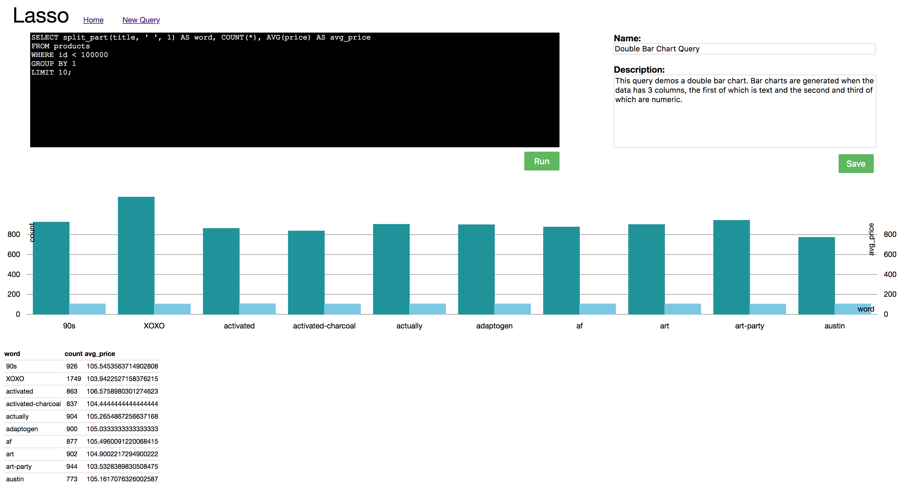

# Lasso
An in-browser SQL editor built with React &amp; Node.js.



## Features
- Run database queries from a clean browser interface.
- Save queries and share with coworkers.
- Auto generate charts based on data types.

## Charts
Lasso will auto-generate a data visualization if the order of the columns matches one of the data structures below. (More coming soon!)
- Scatter Plot (number, number)
- Bar Chart (string, number)
- Grouped Bar Chart (string, number, number)

## Development
### Installing Dependencies & Getting Started

From within the root directory:

```sh
npm install -g webpack
npm install
mongod
npm run react-dev
npm run start
```

Navigate to http://localhost:3000 in your browser.  The client will automatically connect to Postgres running locally.  If this is not available, you can enable a different client in the DB folder.
